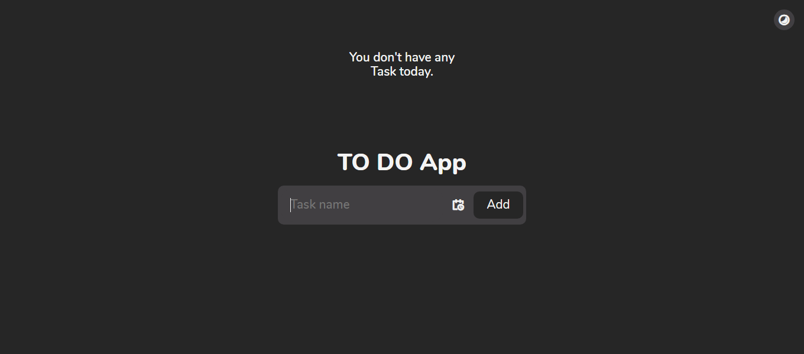
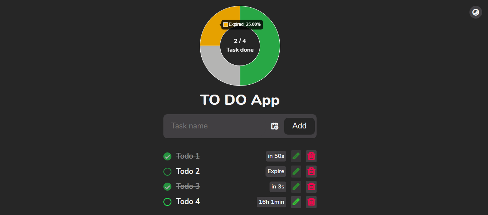
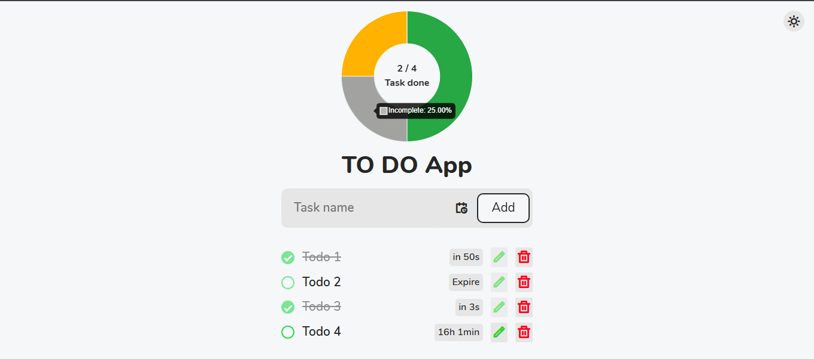
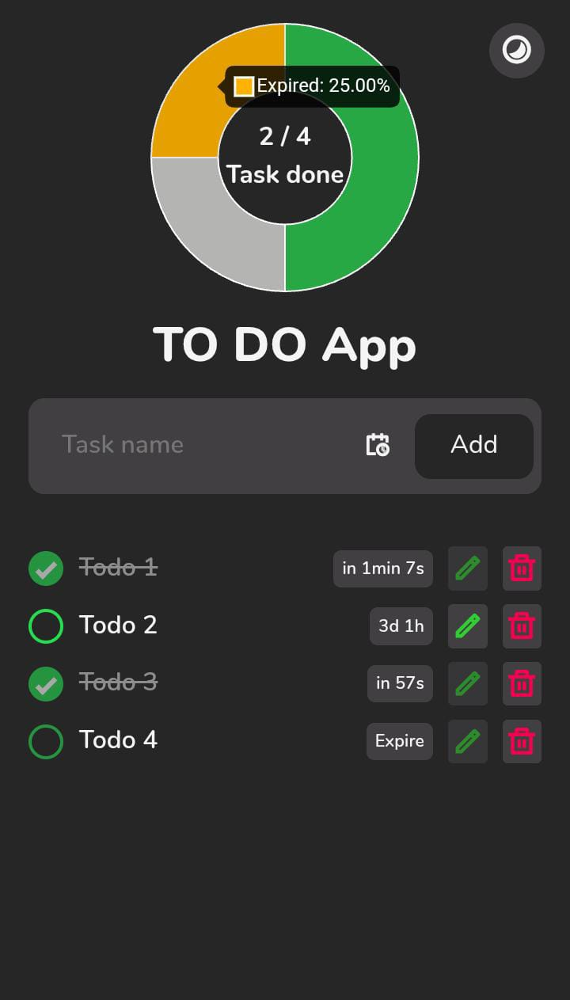

# Modern Todo App






---

## ✨ Description

This is a modern To-Do app that makes task management seamless and efficient. With the latest update, the app now includes a powerful **⏰ Deadline Management System**, allowing you to set deadlines for each to-do. If a deadline is crossed, the task automatically expires, ensuring you stay on top of your priorities. The app also features **📊 Real-Time Chart Updates** that reflect every change—whether a task is completed, deleted, or expired.

All your to-do data is securely stored in **💾 localStorage**, so you don’t have to worry about losing your information. Additionally, the app offers a customizable user experience with **🌞 Light Mode** and **🌙 Dark Mode** options.

---

## 🚀 Features  

### ⏰ **Deadline Management System**  
- Set deadlines for each task.  
- If the deadline is crossed, the task automatically expires.  
- Each to-do has its own efficient timer system to manage deadlines seamlessly.

### 📊 **Real-Time Chart Updates**  
- The dynamic chart automatically refreshes whenever a task is completed, deleted, or expired.  
- Provides an up-to-date visual representation of your task status.  

### 📝 **Direct Task Editing**  
- Modify your to-dos directly from the interface without any hassle.

### ❌ **Task Deletion**  
- Remove tasks easily when they are no longer needed.  

### ✅ **Task Status Toggle**  
- Mark tasks as completed and unmark them to set them back to pending.  

### 🌞🌙 **Light and Dark Modes**  
- Switch between light and dark themes for a comfortable viewing experience.  

### 📊 **Dynamic Completion Chart**  
- Visualize the status of completed, pending, and expired tasks with an interactive chart.  

### 💾 **Local Storage**  
- Your data is securely stored in local storage, ensuring it’s preserved even if you close the app.  

---

## Installation

To install this project, follow these steps:

1. Clone the repository:

   ```bash
   git clone https://github.com/Anshmittal86/To-Do-App.git

   ```

2. Navigate into the project directory:

   ```bash
   cd your-repository

   ```

3. Install the necessary dependencies:

   ```bash
   npm install

            ( or )

   pip install -r requirements.txt

   ```

4. Any other setup instructions

---

## Live Demo

Live:- https://moderntodoappbyansh.netlify.app/

---

## Contributing

If you’d like to contribute to this project, follow these guidelines:

    1. Fork the repository
    2. Create a new branch (git checkout -b feature/your-feature)
    3. Make your changes
    4. Commit your changes (git commit -am 'Add new feature')
    5. Push to the branch (git push origin feature/your-feature)
    6. Create a new Pull Request

---

## License

License
This project is licensed under the MIT License.[MIT](https://choosealicense.com/licenses/mit/)

# Hi, I'm Ansh Mittal! 👋

## 🚀 About Me

I'm a Frontend developer...

## 🔗 Links

[](https://www.linkedin.com/in/anshmittal86)
[](https://x.com/anshmittal8650)

## 🛠 Skills Used

Javascript, HTML, CSS...
