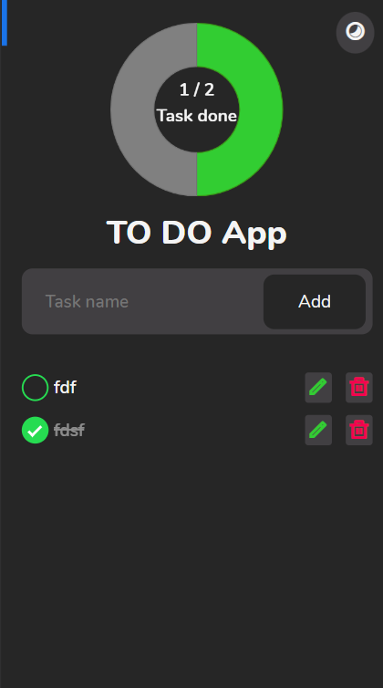

# Modern Todo App





## Description

This is a modern To-Do app that allows you to easily edit, delete, and track the completion status of your tasks. All your to-do data is securely stored in localStorage, so you don’t have to worry about losing your information. Additionally, the app features a dynamic chart to display the number of completed tasks versus remaining tasks.

For a customizable user experience, you can switch between light and dark modes to suit your preference.

## Features

**Direct Task Editing:** Modify your to-dos directly from the interface.
**Task Deletion:** Remove tasks easily when they are no longer needed.
**Task Status Toggle:** Check off tasks as completed and uncheck them to mark them as pending.
**Light and Dark Modes:** Switch between light and dark themes for a comfortable viewing experience.
**Dynamic Completion Chart:** Visualize the status of completed tasks with an interactive chart.
**Local Storage:** Your data is securely stored in local storage, ensuring it’s preserved even if you close the app.

## Installation

To install this project, follow these steps:

1. Clone the repository:

   ```bash
   git clone https://github.com/Anshmittal86/To-Do-App.git

   ```

2. Navigate into the project directory:

   ```bash
   cd your-repository

   ```

3. Install the necessary dependencies:

   ```bash
   npm install

            ( or )

   pip install -r requirements.txt

   ```

4. Any other setup instructions

## Live Demo

Live:- https://anshtodoapp.netlify.app/

## Contributing

If you’d like to contribute to this project, follow these guidelines:

    1. Fork the repository
    2. Create a new branch (git checkout -b feature/your-feature)
    3. Make your changes
    4. Commit your changes (git commit -am 'Add new feature')
    5. Push to the branch (git push origin feature/your-feature)
    6. Create a new Pull Request

## License

License
This project is licensed under the MIT License.[MIT](https://choosealicense.com/licenses/mit/)

# Hi, I'm Ansh Mittal! 👋

## 🚀 About Me

I'm a Frontend developer...

## 🔗 Links

[](https://www.linkedin.com/in/anshmittal86)
[](https://x.com/anshmittal8650)

## 🛠 Skills Used

Javascript, HTML, CSS...
